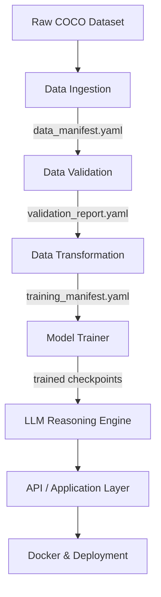

# VisionLLM_InteractionAnalysis

End-to-end computer vision and LLM-based reasoning system using **Faster R-CNN** object detection, trained on **COCO**, and designed for downstream analysis of **naturalistic child–caregiver interaction imagery and video**.

This project follows a **strict, artifact-driven machine learning pipeline**, emphasizing reproducibility, validation, and scalability across research and production environments.

---

## Pipeline Diagram

---

## Pipeline Stages (Implemented)

### **Stage 1: Data Ingestion**
**Goal:** Stage raw COCO-style datasets and create a canonical manifest.

- Downloads COCO train/val data
- Stages images and annotations on scratch storage
- Verifies directory structure
- Writes a dataset manifest

**Artifact:**
- `artifacts/<timestamp>/data_ingestion/data_manifest.yaml`

---

### **Stage 2: Data Validation**
**Goal:** Ensure dataset integrity before training.

- Validates manifest structure
- Checks image/annotation consistency
- Verifies COCO JSON schema
- Detects invalid bounding boxes
- Applies configurable tolerance (production-grade)

**Artifact:**
- `artifacts/<timestamp>/data_validation/data_validation_report.yaml`

---

### **Stage 3: Data Transformation**
**Goal:** Prepare a clean, training-ready dataset.

- Reads ingestion manifest + validation report
- Drops only invalid annotation IDs
- Preserves raw data immutability
- Writes cleaned COCO annotations
- Produces training manifest

**Artifacts:**
- `instances_train2017.cleaned.json`
- `instances_val2017.cleaned.json`
- `training_manifest.yaml`

---

### **Stage 4: Model Trainer**
**Goal:** Train object detection models reproducibly.

- Faster R-CNN (ResNet-50 FPN)
- Config-driven via `model.yaml`
- Optuna-based hyperparameter optimization
- MLflow experiment tracking via DagsHub
- Best + last model checkpointing

**Artifacts:**
- `fasterrcnn_best.pt`
- `fasterrcnn_last.pt`
- `training_report.yaml`

---

## Design Principles

- Manifest-driven data flow
- Immutable raw data
- Strict validation before training
- Explicit artifacts at every stage
- HPC and cloud compatible
- Reproducible experiments

---
## Next stages
### **Stage 5: LLM-Based Reasoning**
- Object-level symbolic representations
- Promptable scene reasoning
- Multimodal grounding (vision + text)

### **Stage 6: API Layer**
- FastAPI / Flask service
- Inference endpoints
- Structured JSON outputs

### **Stage 7: Containerization**
- Dockerized training & inference
- GPU-ready images

### **Stage 8: Deployment**
- CI/CD pipelines
- Cloud or HPC deployment
- Monitoring & experiment tracking

---

## Target Use Cases

- Child–caregiver interaction research
- Egocentric image & video analysis
- Multimodal AI pipelines
- Transfer learning to domain-specific datasets

---

**Author:** Arun Prakash Singh  
**Affiliation:** University of Oslo  
